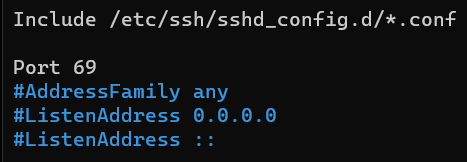

# SSH Honeypot - Penilaian 2 Keamananan Jaringan Komputer (A)

**Kelompok 6**

Nama Anggota Kelompok | NRP
------------------- | --------------
Rendy Anfi Yudha | 5027211006		
Aqil Sulthan Yuki Maye | 5027211007
Abdul Zaki Syahrul Rahmat | 5027211020
Gilbert Immanuel Hasiholan | 5027211056
Athaya Reyhan Nugroho | 5027211067


## Deskripsi

SSH-Honeypot adalah alat simulasi server SSH yang rentan, dirancang untuk menarik serangan keamanan. Berbeda dengan server SSH aktual, alat ini merekam informasi setiap upaya login yang masuk, termasuk username, password, alamat IP, dan waktu percobaan login. Tujuannya adalah untuk menarik perhatian penyerang yang mencoba mengeksploitasi kelemahan keamanan dalam protokol SSH, sementara secara simultan melindungi server sebenarnya dari serangan tersebut. Dengan menggunakan SSH-Honeypot, administrator jaringan dapat memantau dan menganalisis serangan yang dilakukan untuk meningkatkan keamanan sistem mereka dengan mempelajari pola serangan yang umum terhadap layanan SSH.


## Instalasi

    1. Buat public key RSA untuk digunakan oleh server:
        > ssh-keygen -t rsa 

    2. Edit file config.h untuk mengatur opsi yang diinginkan. Atur RSA_KEYFILE ke lokasi public key yang dihasilkan pada langkah satu. LOGFILE harus diatur ke lokasi di mana pengguna yang menjalankan sshpot dapat menulis.

    3. Compile dengan make:
        > make
        # make install


## Penggunaan

Akses server SSH utama:
```
ssh rendaemon@10.15.42.241 [-p <port>]
```
-p  --port <port>   Port yang dilisten; port defaultnya adalah 22.

Mengubah port yang dilisten 22 menjadi 69 di
```
/etc/ssh//sshd_config
```


Sehingga akses server SSH utama menjadi
```
ssh rendaemon@10.15.42.241 -p 69
```

Akses server SSH jebakan:
```
sudo ssh rendaemon@10.15.42.241
```

## Dokumentasi & Log
- Testing

Tes dilakukan dengan mencoba melakukan upaya login secara paksa.


- Log hasil informasi dari setiap upaya login yang masuk

Log akan mencatat berbagai detail dari setiap upaya login yang mencakup username yang digunakan, password yang dicoba, alamat IP asal percobaan login, serta waktu atau tanggal dari percobaan tersebut. 
Log pada Honeypot dapat disimpan ke dalam [file .txt](https://github.com/RenDaemon/ssh-honeypot/blob/main/honeypot_log.txt)
Format dari log Honeypot adalah sebagai berikut
```
[timestamp]    [IP Address]    [username]    [password]
```


Dependencies yang digunakan:

- libssh
```
http://www.libssh.org/
```

# Medium
https://medium.com/@athreyhan04/implementasi-honeypot-berbasis-ssh-9a97ad2cb89e?postPublishedType=initial
