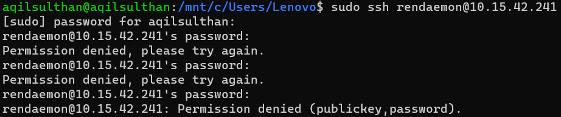
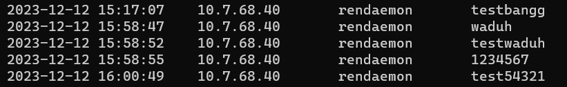

# Penilaian 2 Kemananan Jaringan Komputer (A)

**Kelompok 6**

Nama Anggota Kelompok | NRP
------------------- | --------------
Rendy Anfi Yudha | 5027211006		
Aqil Sulthan Yuki Maye | 5027211007
Abdul Zaki Syahrul Rahmat | 5027211020
Gilbert Immanuel Hasiholan | 5027211056
Athaya Reyhan Nugroho | 5027211040


## Deskripsi

SSH-Honeypot adalah sistem yang dirancang untuk menarik serangan keamanan dengan menyimulasikan server SSH yang rentan. Berbeda dengan server SSH nyata, SSH-Honeypot tidak mengautentikasi pengguna; sebaliknya, ia merekam informasi dari setiap upaya login yang masuk, seperti username, password, alamat IP, serta waktu dari setiap percobaan login. Tujuannya adalah untuk menarik perhatian penyerang yang mencoba mengeksploitasi kelemahan keamanan dalam protokol SSH, sementara secara simultan melindungi server sebenarnya dari serangan tersebut. Dengan menggunakan SSH-Honeypot, administrator jaringan dapat memantau dan menganalisis serangan yang dilakukan untuk meningkatkan keamanan sistem mereka dengan mempelajari pola serangan yang umum terhadap layanan SSH.


## Instalasi

    1. Buat public key RSA untuk digunakan oleh server:
        > ssh-keygen -t rsa 

    2. Edit file config.h untuk mengatur opsi yang diinginkan. Atur RSA_KEYFILE ke lokasi public key yang dihasilkan pada langkah satu. LOGFILE harus diatur ke lokasi di mana pengguna yang menjalankan sshpot dapat menulis.

    3. Compile dengan make:
        > make
        # make install


## Penggunaan

Akses server SSH utama:
```
ssh rendaemon@10.15.42.241 -p 69
```
-p  --port <port>   Port yang dilisten; port defaultnya adalah 69.

Akses server SSH jebakan:
```
ssh rendaemon@10.15.42.241
```

## Dokumentasi
- Testing

Tes dilakukan dengan mencoba melakukan upaya login secara paksa.



- Log hasil informasi dari setiap upaya login yang masuk

Log akan mencatat berbagai detail dari setiap upaya login yang mencakup username yang digunakan, password yang dicoba, alamat IP asal percobaan login, serta waktu atau tanggal dari percobaan tersebut. 



Dependencies yang digunakan:

    libssh http://www.libssh.org/
